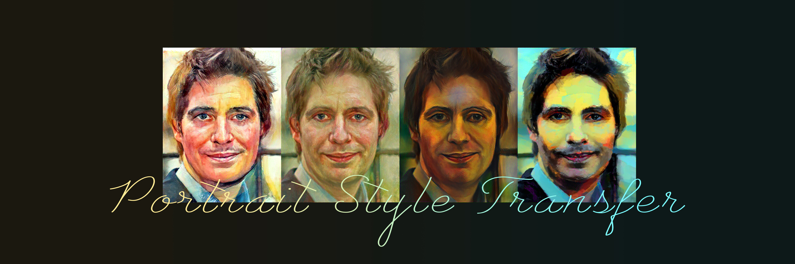
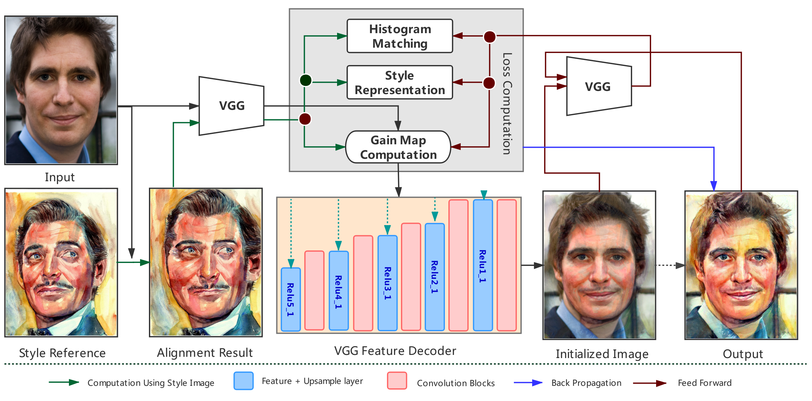
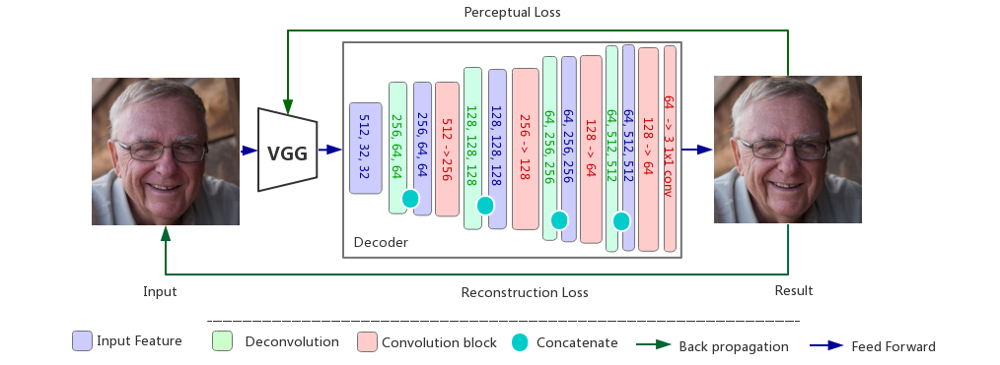

# PortraitST

ESTR4998 Final Year Project. This is a head portrait style transfer based on VGG19 neural network feature.

\
The overall process (we disabled the histogram match in the current version)
\
The VGG decoder structure.

[report here](ref/report.pdf)
## How to use it?
#### Step1: Install all following required packages:

tensorboardX\
pytorch(GPU)\
dlib\
numpy\
opencv-python\
pillow

#### Step2: Download weights.
Download weights from this [link](https://mycuhk-my.sharepoint.com/:f:/r/personal/1155091988_link_cuhk_edu_hk/Documents/weights%20for%20PortraiST?csf=1&e=97hHrw),
then put them under the *./weight* directory.

#### Step3: Upload style and input images.
The program was designed only for one input with multiple styles. You can put your input image into the *./test/input* folder, put your style references (it should have a clear face which could be regonized by dlib face detector) into the *./test/style* directory.

#### Step4: Run it.
goto the /gainmap directory, run *run.py* and get result from *./test/result* as well as alignment result from *./test/align*.

#### Some tips:
1. this program can only test for front face and please make sure the portrait is the main part of the input image.
2. There must be many bugs and low efficiency implementation details in this baby project... 

## Daliy Report

### 20190913
Reference paper reading, two parts initially: image alignment and feature gain map (VGG19 based).\
TODOLIST: 
1. Dlib landmark model -> 68 facial landmarks -> test performance of **image morphing.**
2. VGG feature extraction (conv3, conv4, conv5). Visualization of feature, gain map implementation.

### 20190914-15
1. Dlib feature extraction implementation (68 facial landmarks). 
2. The gain map implementation and stageA transfer process. 
3. Still confusing about the transpose part and weight balance between two loss terms. Needs DEBUG in ./gainmap/modify.py. The layers used for feature extraction needs furthur confirmation.

### 20190917
Facial landmark detection COMPLETED.\
Delaunay trianglation (index vs coordinates) -> further working.

### 20190918-19
Morphing COMPLETED.\
Multilayer feature extraction implementation, not tested yet.

### 20190920
Loss implementaion completed. Future work: back-propagation effectiveness, detail preserving and new style testing.

### 20190926
All layer testing (stated in the paper presentation). No satisfying improvements, time increased.\
More samples needed... PLEASE!

### 20190930
Unet-like reconstructor implementation.\
Facial detection crop. Experiments around different set of parameters to balance loss terms.

### 20191004
1. ADD landmarks -- up to 81+8 now.
2. Reconstruction network completed, GPU account is required to train it.

### 20191012
1. Reconstruction for VGG works well.
2. sift flow used, but get a unsatisfying effect.
3. (Future works)) StyLit implementation

### 20191024
Happy progammer's day!\
Coordinate Network is uner construction.\
Traditional StyLit is needed.

### 20200113
The first part pipeline completed!\
Before that, we try to use stylit algorithm to get the detailed high frequency features. Also, we use the texture synthesis method to get the stylized video result.

